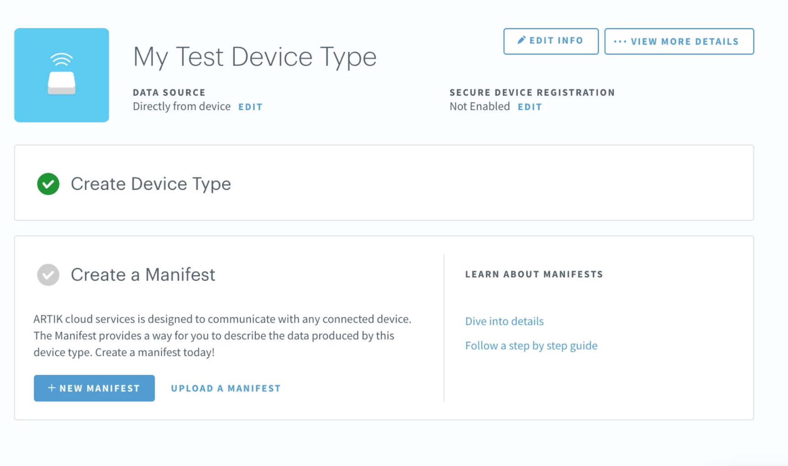
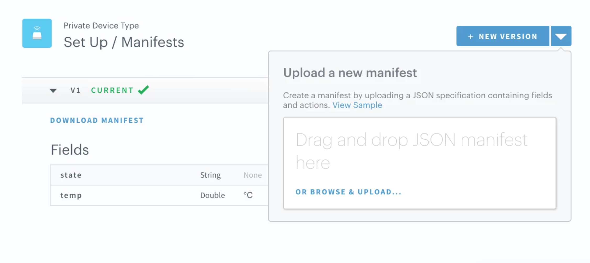

# ARTIK cloud services Import Export Device Type Manifest

This repo provides sample, exported manifests for importing into your ARTIK cloud services account.  The guide below also provides examples of how to import and export a Device Type Manifest.    

##### **Prerequisites**

* Create or use existing [ARTIK Cloud services](https://developer.artik.cloud/) developer account

### Setup / Installation

There is no setup or installation for this sample other than the prerequisites above.

### 1. Create device type 

Briefly follow the instructions here to [creating a new device type](https://developer.artik.cloud/documentation/getting-started/devices.html#create-a-device-type).   

Note in above documentation, there are 3 successive steps (create device type, create manifest, publish).  

Here, just complete the first step to create a device type.   The remaining step, *create a manifest* will be done by importing the `sample-manifest-smart-lock-v1.json` file and we will *publish* as a private device type.

### 2. Import a manifest

From this project, locate the `sample-manifest-smart-lock-v1.json` file.   We will upload this file to import a manifest for the newly created device type you completed in step 1.

**Screenshot**:



Note after importing you can browse and see all fields, actions and other metadata it has added.

Be sure to click Save to publish your changes.   

### 3. View manifest file

Let's take a quick highlevel view of the file that was uploaded `sample-manifest-smart-lock-v1.json`:

```
{
  "actions": [
    {
      "name": "setOn",
      "description": "Set state to On",
      "parameters": [],
      "isStandard": true,
      "type": "CUSTOM"
    },
    {
      "name": "setOff",
      "description": "Set state to Off",
      "parameters": [],
      "isStandard": true,
      "type": "CUSTOM"
    }
  ],
  "fields": [
    {
      "name": "state",
      "type": "CUSTOM",
      "valueClass": "Boolean",
      "isCollection": false,
      "tags": [
        "switch"
      ]
    }
  ],
  "messageFormat": "json"
}
```

Below is a shorter, snipped version of the above to cover highlevel topics of defining `actions` and `fields`.

```
{
  "actions": [
    {"name": "setOn", ...},
    {"name": "setOff", ...}
  ],
  "fields": [
    {"name": "state","valueClass": "Boolean", ...}
  ],
  "messageFormat": "json"
}
```

* Here it defines **2 actions** "setOn" and "setOff".
* It also defines **1 field** called "state" of valueClass type Boolean.

### 4. Export Manifest

Feel free to use the developer portal to manually add an additional field, action, or modify a description and update your Device Type.  Each modification you save will increment the manifest version (ie:  v1, v2, ...)

Here, try yourself and add a new field called "temp".   Try this using the UI or upload a new manifest file.

To export the manifest, the **download manifest** link will export a new `your-device-type-manifest.json` file.   

**Screenshot**:




### 5. Sample Manifest

View the <u>sample manifests</u> folder to view more manifest.json examples.

More about ARTIK cloud services
---------------

If you are not familiar with ARTIK cloud services, we have extensive documentation at https://developer.artik.cloud/documentation

The full ARTIK cloud services API specification can be found at https://developer.artik.cloud/documentation/api-reference/

Peek into advanced sample applications at https://developer.artik.cloud/documentation/tutorials/code-samples/

To create and manage your services and devices on ARTIK cloud services, visit the Developer Dashboard at https://developer.artik.cloud

License and Copyright
---------------------

Licensed under the Apache License. See [LICENSE](LICENSE).

Copyright (c) 2018 Samsung Electronics Co., Ltd.
